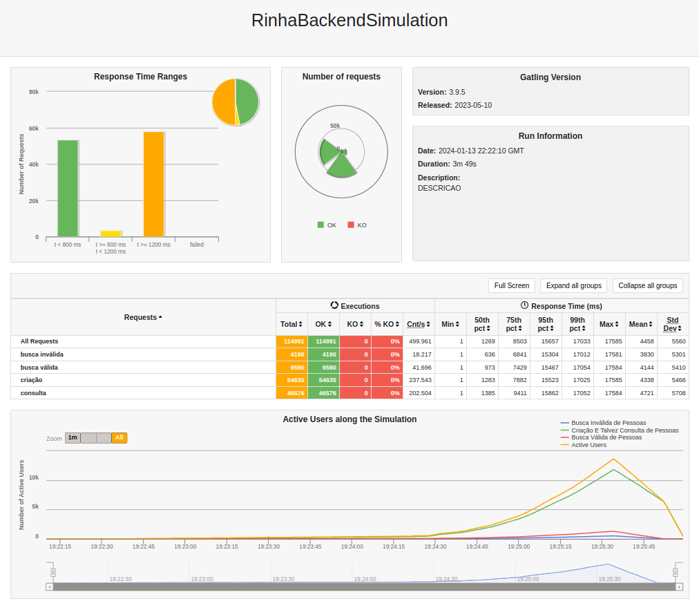
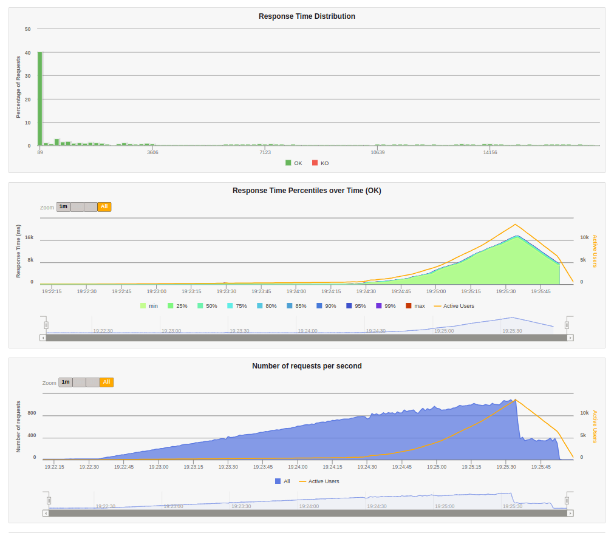
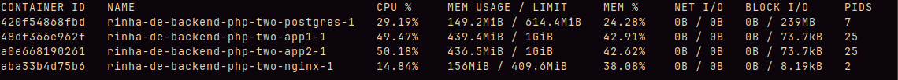

# Rinha de backend

Implementação em PHP da [rinha de backend 2023 Q3](https://github.com/zanfranceschi/rinha-de-backend-2023-q3).

## Objetivo

Implementar a rinha em PHP usando o Laravel, e sem fazer nenuma adição de cache e batch insert.

## Implementações testadas

1. otimizar o autoloader
2. adicionar nginx e PHP-FPM em cada um dos apps
    - piorou
    - eu também tenho uma teoria do motivo da piora, apenas com o "Built-in server do PHP", que roda com apenas 1 de concorrência, o container já topa os 0.5% de CPU, então aumentar a concorrência não faz sentido se não tiver recursos
3. remover nginx e php-fpm
4. adicionar denovo
    - um pouco mais de ajustes no nginx ajudam a dar mais uns 300 inscrições no banco

## Conclusões

Não sei se estou comentendo algum erro muito grande em PHP (nunca programei antes), mas a performance é MUITO pior que o Ruby, e nem se compara com Elixir ou Golang.

Além de que por algumas limitações do ORM do Laravel, algumas coisas bem pesadas tiveram de ser feitas para atingir todos os objetivos da rinha.

## Resultados

### Laptop

|CPU|RAM|
|---|---|
|Ryzen 4750U|16GB|

#### Duas instâncias (com nginx)

##### Resultado do gatling navegador




##### Resultado do gatling console

```
Simulation RinhaBackendSimulation completed in 231 seconds
Parsing log file(s)...
Parsing log file(s) done
Generating reports...

================================================================================
---- Global Information --------------------------------------------------------
> request count                                      70740 (OK=3651   KO=67089 )
> min response time                                      0 (OK=45     KO=0     )
> max response time                                  17018 (OK=17018  KO=7     )
> mean response time                                   688 (OK=13321  KO=0     )
> std deviation                                       3160 (OK=5019   KO=0     )
> response time 50th percentile                          0 (OK=15193  KO=0     )
> response time 75th percentile                          1 (OK=16048  KO=1     )
> response time 95th percentile                         82 (OK=16625  KO=1     )
> response time 99th percentile                      16164 (OK=16919  KO=1     )
> mean requests/sec                                306.234 (OK=15.805 KO=290.429)
---- Response Time Distribution ------------------------------------------------
> t < 800 ms                                           319 (  0%)
> 800 ms <= t < 1200 ms                                 15 (  0%)
> t >= 1200 ms                                        3317 (  5%)
> failed                                             67089 ( 95%)
---- Errors --------------------------------------------------------------------
> j.i.IOException: Premature close                                67089 (100.0%)
================================================================================
A contagem de pessoas é: 2325
```

##### Recusos do docker durante a parte mais pesada do teste


