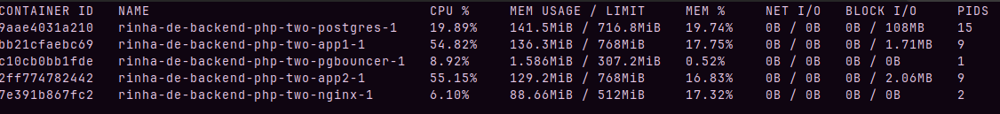
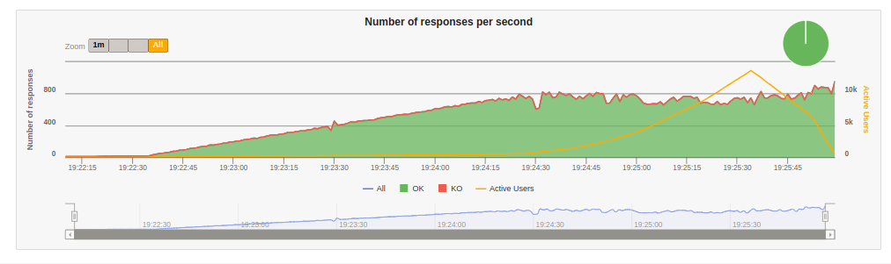

# Rinha de backend

Implementação em PHP da [rinha de backend 2023 Q3](https://github.com/zanfranceschi/rinha-de-backend-2023-q3).

## Outras implementações

- [Elixir](https://github.com/ogabriel/rinha-de-backend-elixir)
- [Ruby](https://github.com/ogabriel/rinha-de-backend-ruby)
- [Golang](https://github.com/ogabriel/rinha-de-backend-golang)

## Objetivo

Implementar a rinha em PHP usando o Laravel, e sem fazer nenuma adição de cache e batch insert.

## Implementações testadas

1. otimizar o autoloader
    - chegando a quase 3K registros
2. adicionar nginx e PHP-FPM em cada um dos apps
    - piorou, foi pra 2K
    - eu também tenho uma teoria do motivo da piora, apenas com o "Built-in server do PHP", que roda com apenas 1 de concorrência, o container já topa os 0.5% de CPU, então aumentar a concorrência não faz sentido se não tiver recursos
3. remover nginx e php-fpm
    - voltou a quase 3K registros
4. adicionar denovo o FPM e nginx
    - mexendo mais um pouco, chegou a um pouco mais de 3K registros
    - um pouco mais de ajustes no nginx ajudam a dar mais uns 300 inscrições no banco
5. adicionar opcache e usar uma máquina mais potente
    - chegou a 8K registros
6. adicionar pgbouncer
    - chegou a mais de 20K registros
    - laravel não tem um connection pool, e no postgres isso é muito ruim pois toda conexão é uma thread, e é muito pesado criar e fechar uma conexão toda hora
    - então o pgbouncer cuida disso e fica mais leve
7. usar JIT no opcache
    - melhorou mais um pouco
8. otimizar recursos para a aplicação PHP
    - deu pra chegar em 33K e 25K no meu laptop
    - PHP usa recursos demais, quanto mais recursos liberados para ele, melhor performance, o bottleneck tava no web server
9. adicionar swoole
    - sem mexer muito mais foi pra 33K registros no laptop, mas tinha algo errado, pq o servidor reiniciava toda hora
    swole é uma extenção que tem uma lógica de coroutine/fiber
    - a performance é bem superior a usar nginx + fpm
10. ajustar settings basicas do swoole
    - deu pra chegar em 37K no meu laptop
    - como quase todo servidor web, o swoole tem um limite de requisições que logo depois reinicia, precisei desligar isso para parar de reiniciar
11. fine tunning nos workers
12. remover o pgbouncer
    - tava usando recursos preciosos
13. aumentar o recurso do nginx
    - foi pra 41K no laptop
    - nginx estava gargalando todo o processo
14. diminuir o worker pra 1 e aumentar bastante os task-workers do swoole
    - 46576 no meu laptop!
    - 1 conexão por container

## Conclusões

Não sei se estou comentendo algum erro muito grande em PHP (nunca programei antes), mas a performance é MUITO pior que o Ruby, e nem se compara com Elixir ou Golang. Além de que por algumas limitações do ORM do Laravel, algumas coisas bem pesadas tiveram de ser feitas para atingir todos os objetivos da rinha.

Mas depois de passar a usar o swoole e fazer vários ajustes, foi possível chegar ao objetivo da rinha. O único problema é a latência, que não parece ser a melhor, mas deve ser por causa da falta de configuração de database pool.

## Resultados

### Desktop

|CPU|RAM|
|---|---|
|Ryzen 5900X|32GB|

#### Duas instâncias (com nginx)

##### Resultado do gatling navegador


##### Resultado do gatling console

```
Simulation RinhaBackendSimulation completed in 205 seconds
Parsing log file(s)...
Parsing log file(s) done
Generating reports...

================================================================================
---- Global Information --------------------------------------------------------
> request count                                     114991 (OK=114991 KO=0     )
> min response time                                      0 (OK=0      KO=-     )
> max response time                                    133 (OK=133    KO=-     )
> mean response time                                     3 (OK=3      KO=-     )
> std deviation                                          8 (OK=8      KO=-     )
> response time 50th percentile                          1 (OK=1      KO=-     )
> response time 75th percentile                          2 (OK=2      KO=-     )
> response time 95th percentile                         10 (OK=10     KO=-     )
> response time 99th percentile                         44 (OK=44     KO=-     )
> mean requests/sec                                558.209 (OK=558.209 KO=-     )
---- Response Time Distribution ------------------------------------------------
> t < 800 ms                                        114991 (100%)
> 800 ms <= t < 1200 ms                                  0 (  0%)
> t >= 1200 ms                                           0 (  0%)
> failed                                                 0 (  0%)
================================================================================
A contagem de pessoas é: 46576
```

##### Recusos do docker durante a parte mais pesada do teste



### Laptop

|CPU|RAM|
|---|---|
|Ryzen 4750U|16GB|

#### Duas instâncias (com nginx)

##### Resultado do gatling navegador




##### Resultado do gatling console

```
Simulation RinhaBackendSimulation completed in 229 seconds
Parsing log file(s)...
Parsing log file(s) done
Generating reports...

================================================================================
---- Global Information --------------------------------------------------------
> request count                                     114991 (OK=114991 KO=0     )
> min response time                                      1 (OK=1      KO=-     )
> max response time                                  17585 (OK=17585  KO=-     )
> mean response time                                  4458 (OK=4458   KO=-     )
> std deviation                                       5560 (OK=5560   KO=-     )
> response time 50th percentile                       1269 (OK=1267   KO=-     )
> response time 75th percentile                       8503 (OK=8503   KO=-     )
> response time 95th percentile                      15657 (OK=15657  KO=-     )
> response time 99th percentile                      17033 (OK=17033  KO=-     )
> mean requests/sec                                499.961 (OK=499.961 KO=-     )
---- Response Time Distribution ------------------------------------------------
> t < 800 ms                                         53508 ( 47%)
> 800 ms <= t < 1200 ms                               3459 (  3%)
> t >= 1200 ms                                       58024 ( 50%)
> failed                                                 0 (  0%)
================================================================================
A contagem de pessoas é: 46576
```

##### Recusos do docker durante a parte mais pesada do teste


