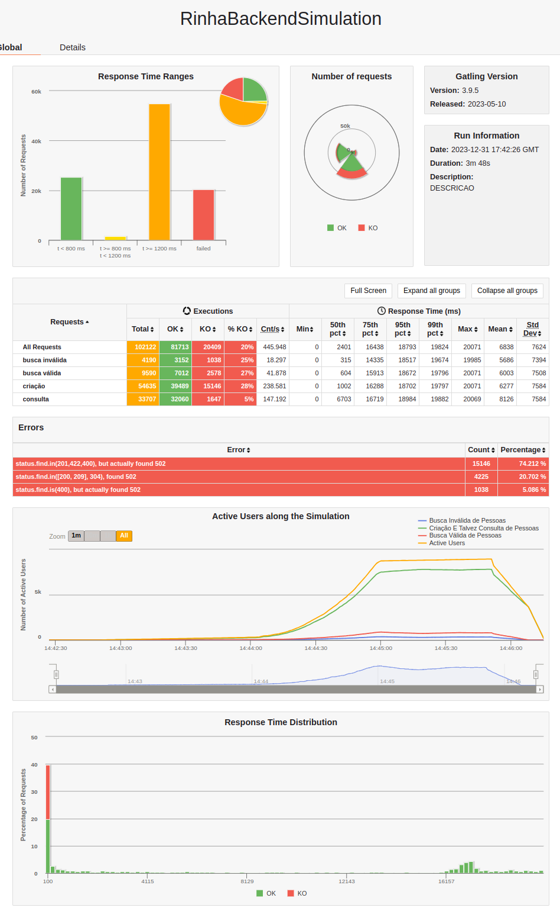
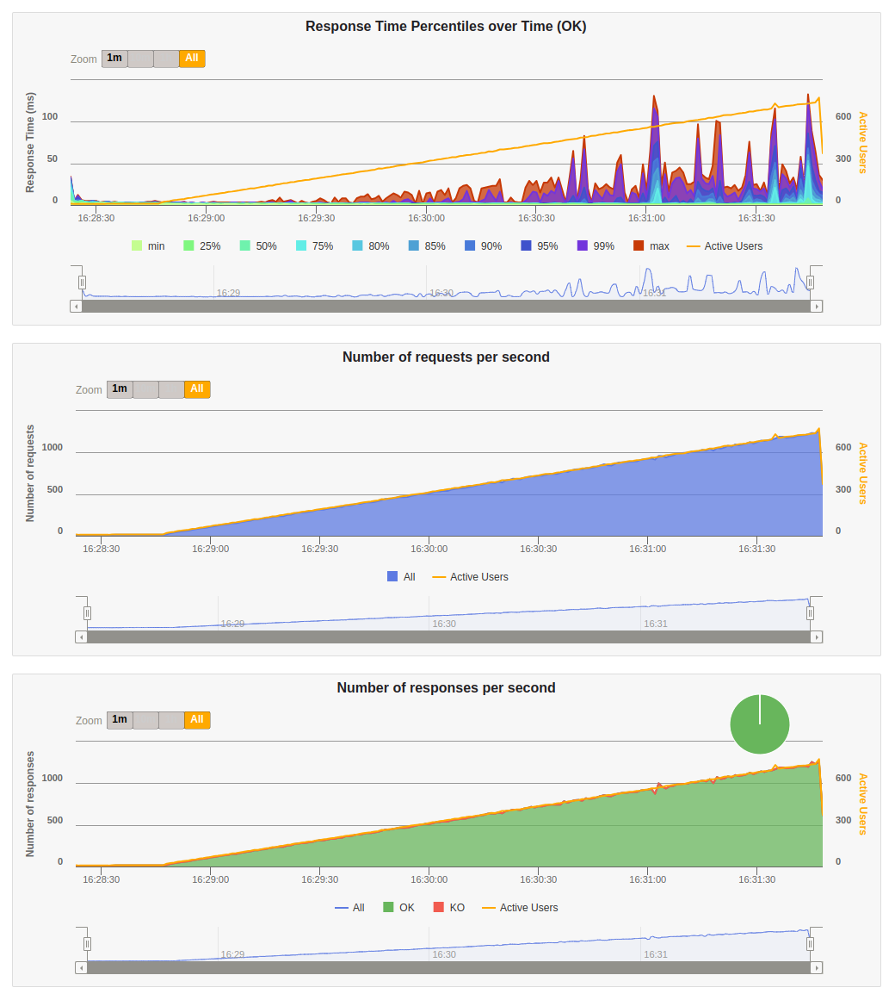

# Rinha de backend

Implementação em PHP da [rinha de backend 2023 Q3](https://github.com/zanfranceschi/rinha-de-backend-2023-q3).

## Objetivo

Implementar a rinha em PHP usando o Laravel, e sem fazer nenuma adição de cache e batch insert.

## Implementações testadas

1. otimizar o autoloader
    - chegando a quase 3K registros
2. adicionar nginx e PHP-FPM em cada um dos apps
    - piorou, foi pra 2K
    - eu também tenho uma teoria do motivo da piora, apenas com o "Built-in server do PHP", que roda com apenas 1 de concorrência, o container já topa os 0.5% de CPU, então aumentar a concorrência não faz sentido se não tiver recursos
3. remover nginx e php-fpm
    - voltou a quase 3K registros
4. adicionar denovo o FPM e nginx
    - mexendo mais um pouco, chegou a um pouco mais de 3K registros
    - um pouco mais de ajustes no nginx ajudam a dar mais uns 300 inscrições no banco
5. adicionar opcache e usar uma máquina mais potente
    - chegou a 8K registros
6. adicionar pgbouncer
    - chegou a mais de 20K registros
    - laravel não tem um connection pool, e no postgres isso é muito ruim pois toda conexão é uma thread, e é muito pesado criar e fechar uma conexão toda hora
    - então o pgbouncer cuida disso e fica mais leve
7. usar JIT no opcache
    - melhorou mais um pouco
8. otimizar recursos para a aplicação PHP
    - PHP usa recursos demais, quanto mais recursos liberados para ele, melhor performance, o bottleneck tava no web server

## Conclusões

Não sei se estou comentendo algum erro muito grande em PHP (nunca programei antes), mas a performance é MUITO pior que o Ruby, e nem se compara com Elixir ou Golang.

Além de que por algumas limitações do ORM do Laravel, algumas coisas bem pesadas tiveram de ser feitas para atingir todos os objetivos da rinha.

## Resultados

### Desktop

|CPU|RAM|
|---|---|
|Ryzen 5900X|32GB|

#### Duas instâncias (com nginx)

##### Resultado do gatling navegador




##### Resultado do gatling console

```
Simulation RinhaBackendSimulation completed in 228 seconds
Parsing log file(s)...
Parsing log file(s) done
Generating reports...

================================================================================
---- Global Information --------------------------------------------------------
> request count                                     102122 (OK=81713  KO=20409 )
> min response time                                      0 (OK=1      KO=0     )
> max response time                                  20071 (OK=20071  KO=76    )
> mean response time                                  6838 (OK=8539   KO=25    )
> std deviation                                       7624 (OK=7626   KO=20    )
> response time 50th percentile                       2401 (OK=7221   KO=24    )
> response time 75th percentile                      16438 (OK=16865  KO=41    )
> response time 95th percentile                      18793 (OK=18996  KO=59    )
> response time 99th percentile                      19824 (OK=19882  KO=65    )
> mean requests/sec                                445.948 (OK=356.825 KO=89.122)
---- Response Time Distribution ------------------------------------------------
> t < 800 ms                                         25296 ( 25%)
> 800 ms <= t < 1200 ms                               1586 (  2%)
> t >= 1200 ms                                       54831 ( 54%)
> failed                                             20409 ( 20%)
---- Errors --------------------------------------------------------------------
> status.find.in(201,422,400), but actually found 502             15146 (74.21%)
> status.find.in([200, 209], 304), found 502                       4225 (20.70%)
> status.find.is(400), but actually found 502                      1038 ( 5.09%)
================================================================================
A contagem de pessoas é: 33707
```

##### Recusos do docker durante a parte mais pesada do teste


### Laptop

|CPU|RAM|
|---|---|
|Ryzen 4750U|16GB|

#### Duas instâncias (com nginx)

##### Resultado do gatling navegador


##### Resultado do gatling console

```
Simulation RinhaBackendSimulation completed in 253 seconds
Parsing log file(s)...
Parsing log file(s) done
Generating reports...

================================================================================
---- Global Information --------------------------------------------------------
> request count                                      94168 (OK=57216  KO=36952 )
> min response time                                      0 (OK=2      KO=0     )
> max response time                                  33477 (OK=33477  KO=160   )
> mean response time                                 11373 (OK=18686  KO=50    )
> std deviation                                      13477 (OK=12752  KO=34    )
> response time 50th percentile                       1344 (OK=22005  KO=47    )
> response time 75th percentile                      27803 (OK=30801  KO=74    )
> response time 95th percentile                      32540 (OK=32976  KO=113   )
> response time 99th percentile                      33196 (OK=33255  KO=132   )
> mean requests/sec                                 370.74 (OK=225.26 KO=145.48)
---- Response Time Distribution ------------------------------------------------
> t < 800 ms                                          9195 ( 10%)
> 800 ms <= t < 1200 ms                                718 (  1%)
> t >= 1200 ms                                       47303 ( 50%)
> failed                                             36952 ( 39%)
---- Errors --------------------------------------------------------------------
> status.find.in(201,422,400), but actually found 502             24493 (66.28%)
> status.find.in([200, 209], 304), found 502                      10774 (29.16%)
> status.find.is(400), but actually found 502                      1685 ( 4.56%)
================================================================================
A contagem de pessoas é: 25753
```

##### Recusos do docker durante a parte mais pesada do teste


